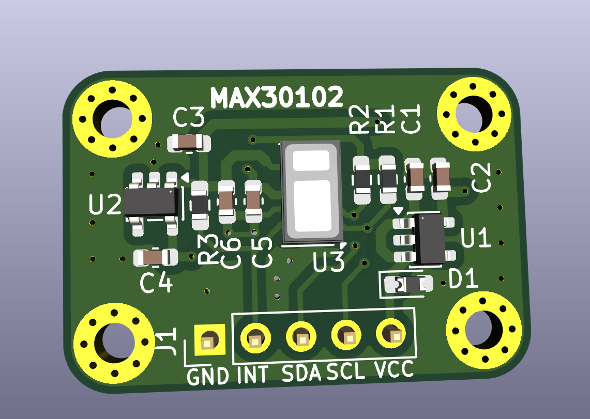
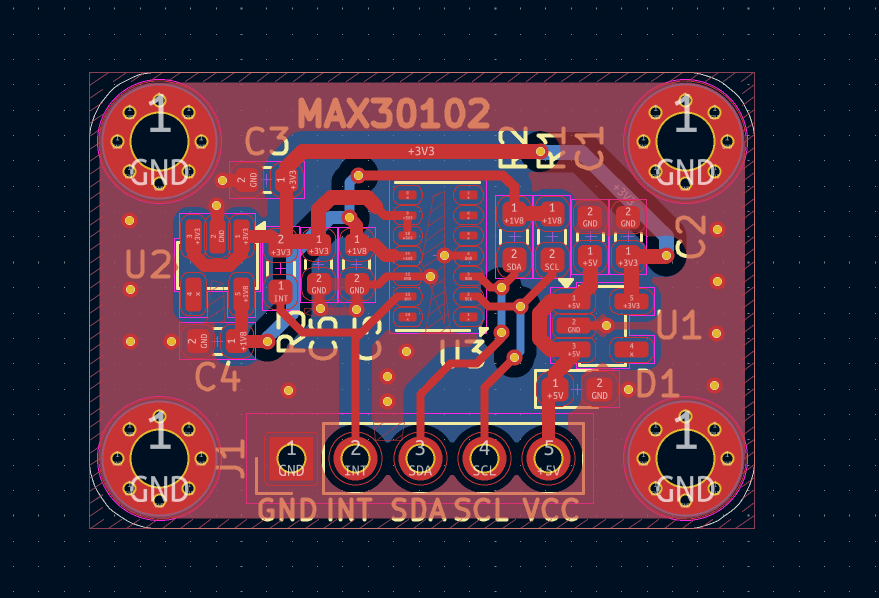
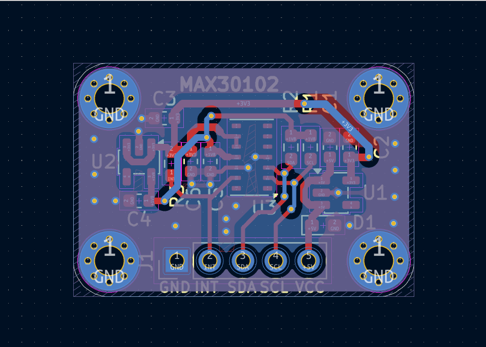
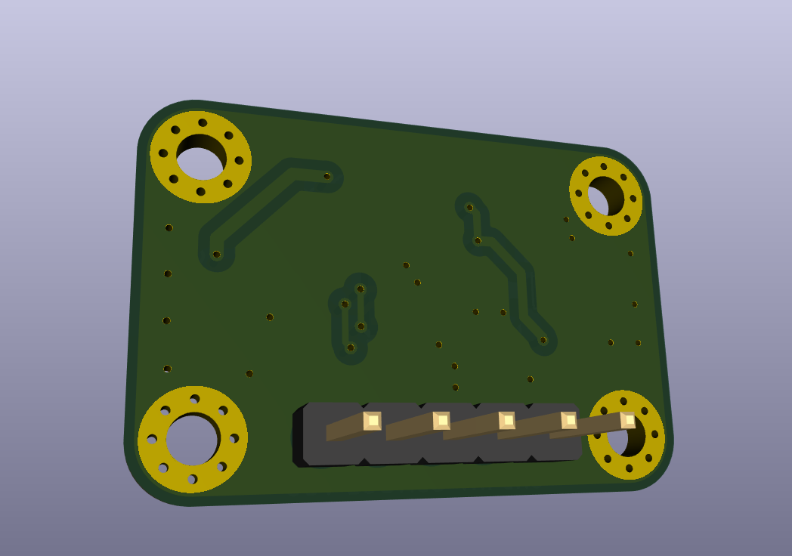

# MAX30102 Optical Sensor Board

<p align="center">
  
</p>

<p align="center">
  <strong>MAX30102 • Dual Supply Rails • I²C • 2-Layer PCB • KiCad</strong>
</p>

<p align="center">
  A compact optical sensing board centered on the MAX30102
  integrated pulse-oximetry and heart-rate sensor.
</p>

<p align="center">
  <a href="docs/max30102_schematic.pdf">Schematic</a> •
  <a href="bom/MAX30102_BOM.csv">BOM</a> •
  <a href="manufacturing/gerbers/">Gerbers</a> •
  <a href="hardware/kicad/">KiCad Files</a>
</p>

---

## Overview

The **MAX30102 Optical Sensor Board** is a compact 2-layer PCB designed
around the **MAX30102** sensor.

The board provides the MAX30102 with dedicated supply regulation,
I²C connectivity, interrupt access, and a 5-pin external interface.

The complete hardware design package is included in this repository,
covering the native **KiCad project**, schematic, PCB layout, BOM,
Gerber and drill manufacturing files, pick-and-place data, and board
documentation.

---

## Quick Access

| Resource | Description |
|---|---|
| 📐 [Schematic PDF](docs/max30102_schematic.pdf) | Electrical schematic |
| 📦 [Bill of Materials](bom/MAX30102_BOM.csv) | Component BOM |
| 🏭 [Gerber & Drill Files](manufacturing/gerbers/) | PCB manufacturing data |
| 🔧 [KiCad Project](hardware/kicad/) | Native KiCad design files |
| 🖼️ [Board Images](docs/images/) | 3D renders and PCB views |
| 📍 [Pick-and-Place Data](manufacturing/pick-and-place/) | Component placement files |

---

## Key Features

| Feature | Details |
|---|---|
| **Optical Sensor** | MAX30102 |
| **Sensor Function** | Pulse oximetry and heart-rate sensing |
| **Digital Interface** | I²C |
| **Interrupt** | Dedicated INT connection |
| **Input Supply** | +5 V |
| **Logic / Sensor Rail** | +3.3 V |
| **LED Supply Rail** | +1.8 V |
| **3.3 V Regulator** | AP2112K-3.3 |
| **1.8 V Regulator** | TLV70018 |
| **Protection** | SMAJ5.0A TVS diode |
| **External Interface** | 1×5 pin header |
| **PCB** | 2-layer |
| **EDA Software** | KiCad |
| **PCB Thickness** | 1.6 mm |
| **Manufacturing Data** | Gerber + PTH/NPTH drill |
| **Assembly Data** | Pick-and-place CSV |

---

## PCB Preview

### 3D Board Render

<p align="center">
  
</p>

### PCB Front Layout

<p align="center">
  
</p>

### PCB Back Layout

<p align="center">
  
</p>

### 3D Bottom View

<p align="center">
  
</p>

---

## Hardware Architecture

The board is organized around the MAX30102 sensor and its associated
power and interface circuitry.

### MAX30102 Sensor

The **MAX30102** integrates optical sensing functionality for
pulse-oximetry and heart-rate applications.

The sensor interface exposes:

- I²C clock — SCL
- I²C data — SDA
- Interrupt — INT
- Sensor supply — +3.3 V
- LED supply — +1.8 V

### Power Architecture

The board contains dedicated regulation stages for the sensor system:

- **+5 V input**
- **AP2112K-3.3** for the +3.3 V rail
- **TLV70018** for the +1.8 V rail
- Input transient protection

### External Interface

A 5-pin header provides the primary external connection to the board.

| Pin | Signal |
|---|---|
| 1 | +3.3 V |
| 2 | GND |
| 3 | +5 V |
| 4 | SCL |
| 5 | SDA |

The interrupt signal is routed to the MAX30102 interface circuitry.

---

## PCB Design

The board is implemented as a **2-layer PCB** using **KiCad**.

### PCB Characteristics

- 2-layer signal routing
- 1.6 mm board thickness
- Compact sensor-oriented layout
- Dedicated regulated supply rails
- I²C interface routing
- MAX30102 sensor placement
- Input transient protection
- External 5-pin interface

---

## Design Files

The native KiCad project is located in:

[**hardware/kicad/**](hardware/kicad/)

### Main Files

| File | Description |
|---|---|
| `max30102_pcb.kicad_pro` | KiCad project |
| `max30102_pcb.kicad_sch` | Schematic source |
| `max30102_pcb.kicad_pcb` | PCB layout |

The exported schematic PDF is available in
[**docs/**](docs/).

---

## Manufacturing Outputs

The manufacturing package is available in:

[**manufacturing/gerbers/**](manufacturing/gerbers/)

The package contains:

- Front copper
- Back copper
- Front solder paste
- Back solder paste
- Front silkscreen
- Back silkscreen
- Front solder mask
- Back solder mask
- Board outline
- PTH drill data
- NPTH drill data
- Gerber job file

---

## Bill of Materials

The component BOM is available in:

[**bom/MAX30102_BOM.csv**](bom/MAX30102_BOM.csv)

The BOM contains the component references, quantities, values,
footprints, and available manufacturer/supplier information associated
with the design.

---

## Pick-and-Place Data

Assembly placement data is available in:

[**manufacturing/pick-and-place/**](manufacturing/pick-and-place/)

The package contains separate top-side and bottom-side component
position CSV files.

---

## Documentation

The repository includes:

- Electrical schematic PDF
- PCB front layout
- PCB back layout
- 3D top render
- 3D bottom render
- Bill of materials
- Manufacturing outputs
- Pick-and-place data
- Native KiCad design files

---

## Project Status

| Item | Status |
|---|---|
| Schematic | ✅ Completed |
| PCB Layout | ✅ Completed |
| PCB Layer Count | ✅ 2-layer |
| KiCad Project | ✅ Included |
| BOM | ✅ Included |
| Gerber Files | ✅ Generated |
| Drill Files | ✅ Generated |
| Pick-and-Place Data | ✅ Included |
| Documentation | ✅ Included |

---

## Repository Structure

```text
.
├── hardware/
│   └── kicad/
│       ├── max30102_pcb.kicad_pro
│       ├── max30102_pcb.kicad_sch
│       └── max30102_pcb.kicad_pcb
│
├── manufacturing/
│   ├── gerbers/
│   │   ├── max30102_pcb-F_Cu.gbr
│   │   ├── max30102_pcb-B_Cu.gbr
│   │   ├── max30102_pcb-F_Silkscreen.gbr
│   │   ├── max30102_pcb-B_Silkscreen.gbr
│   │   ├── max30102_pcb-F_Mask.gbr
│   │   ├── max30102_pcb-B_Mask.gbr
│   │   ├── max30102_pcb-F_Paste.gbr
│   │   ├── max30102_pcb-B_Paste.gbr
│   │   ├── max30102_pcb-Edge_Cuts.gbr
│   │   ├── max30102_pcb-PTH.drl
│   │   ├── max30102_pcb-NPTH.drl
│   │   └── max30102_pcb-job.gbrjob
│   │
│   └── pick-and-place/
│       ├── max30102_pcb-top-pos.csv
│       └── max30102_pcb-bottom-pos.csv
│
├── bom/
│   └── MAX30102_BOM.csv
│
├── docs/
│   ├── images/
│   │   ├── 3D_TOP.png
│   │   ├── 3D_BOTTOM.png
│   │   ├── Layout_front.png
│   │   └── Layout_back.png
│   │
│   └── max30102_schematic.pdf
│
├── .gitignore
├── CONTRIBUTING.md
├── LICENSE
└── README.md
```

---

## License

The hardware design files in this repository are licensed under the
**CERN Open Hardware Licence Version 2 - Strongly Reciprocal
(CERN-OHL-S-2.0)**.

The licence permits use, modification, distribution, and manufacture
under the terms of the CERN-OHL-S-2.0 licence, with the corresponding
source-sharing requirements for covered hardware.

**Copyright © 2026 Habib Ur Rehman**

See [`LICENSE`](LICENSE) for the licence identifier and official
licence reference.

---

## Author

### Habib Ur Rehman

**Electronics Engineering**  
**University of Engineering and Technology Peshawar (Abbottabad Campus)**

### Connect

- **GitHub:** [Habib-creater](https://github.com/Habib-creater)
- **LinkedIn:** [Habib Ur Rehman](https://www.linkedin.com/in/habib-ur-rehman-8321182b4/)

---

<p align="center">
  <strong>MAX30102 Optical Sensor Board</strong><br>
  Compact Open Hardware Sensor Platform
</p>
